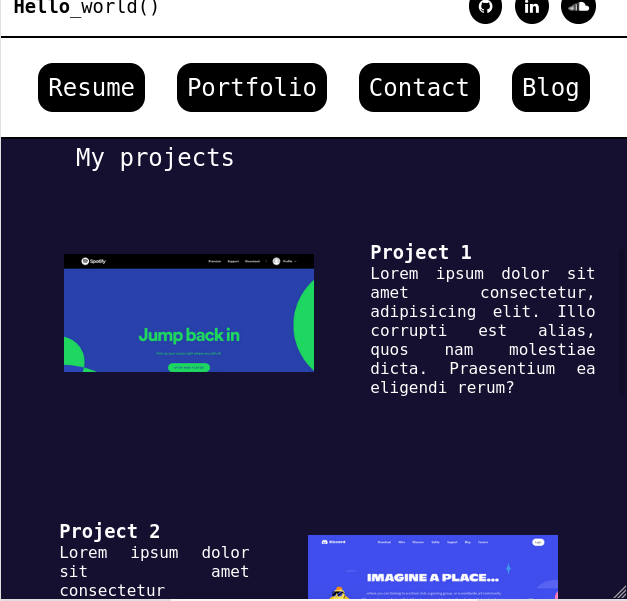

# Portfolio Documentation

---
### <a href="https://thriving-treacle-8b6b78.netlify.app/index.html">Live site</a>
### <a>Git repo</a>

---

## Purpose and Target Audience

This online dev portfolio is intended to provide a general background on myself and my past experience as well as to demonstrate my abilities in static web development with HTML5 and CSS3. 

The site is intended for prospective employers, potential collaborators and future clients.

---

## Tech Stack

HTML5, vanilla CSS3, Figma (wireframes), netlify (deployment)

---

## Site map

### Navigation map

---

## Wireframes and design

I decided to implement a simple flex-column layout for much of the portfolio. To avoid cluttering of features I segregated components with hard borders and background color shifts. Below are some examples of wireframes I used during the design process. Wireframes constructed using Figma.

Desktop index.html:

mobile index.html:
.png)

---

## Functionality & Features (incl.Screenshots)

### Index.html

The homepage of the portfolio contains a number of stand-alone components positoned in a flex-column and divided using strong borders and background color contrasts. On screens less than 600px, the hero image component was removed, as was the primary navbar, which was moved to a 'hamburger'-style dropdown menu for mobile devices.

Navigation items comprise <em>Resume</em>, <em>Portfolio</em>, <em>Contact</em> and <em>Blog</em>. To minimise page navigation for the user, the 'portfolio', 'about' and 'contact' components were included on the landing page (index.html), as seen here:

This is the mobile screen (note 'hamburger' nav menu):

the primary navbar was moved to the header on desktop screens to take advantage of larger real estate for the hero component:

Scroll down to bio, projects, stack, contact sections:

Project thumbnail links are styled with a hover feature, for desktop and tablets only.

### Resume

My resume is located on its own designated page (cv.html), accompanied with an option to download the PDF version.

### Bloglist

All my blogs are indexed as a list on the 'blog' hompage which is navigatable using the primary navbar (hamburger nav for mobile).

### Blogs 1,2,n

All blogs have their own page with responsive layouts. Blog entries are relevant to software development as a whole and share an emphasis on text start-up culture.

---

## Notes and work-arounds

Since this was my first attempt at a static website, I encountered a number of idiosyncratic problems. Some notes and work-arounds I encountered for basic problems include:

- **Relative linking WITHIN the page:**
    it seems Mozilla does not recogise internal links without anchor tags, also they do not recognise id="".
    So to get cross-browser linking functionality, I used both id="" and name="", and added "a" tags within divs that had internal relative links. (source:https://stackoverflow.com/questions/23282075/a-href-link-not-working)

- **The Hamburger Nav dropdown using only CSS**:
    In order to build a drop-down menu using only vanilla CSS, I used the 'input' element with a 'checkbox' attribute. This is a common element used in forms that allowed me to reveal a dropdown nav menu when the checkbox was 'checked'. All that needed to be done to substitute the checkbox with a hamburger menu icon was to position the icon over the box then set its display to none.

- **displaying .svg images in Chrome was problematic:**
    svg. images set within an 'img' tag failed to display in Chrome upon deployment so I was forced to . A potential work-around that I decided not to use can be found here: https://stackoverflow.com/questions/10737166/chrome-not-rendering-svg-referenced-via-img-element

